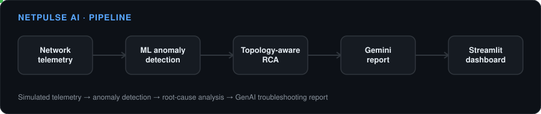
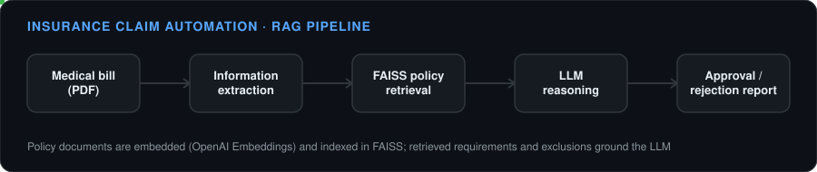
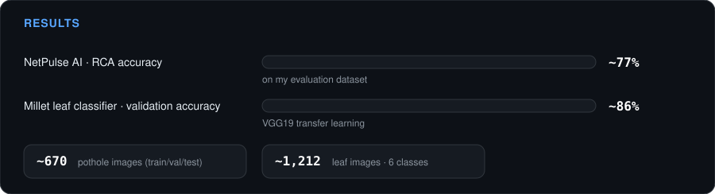

  

**Machine Learning · Generative AI · RAG · Computer Vision**

Computer Science & Engineering (AI) student building practical AI systems with Python

&nbsp;&nbsp;

🟢 **Seeking internships in AI Engineering · ML · GenAI · Computer Vision · RAG · AI Agents**

---

## 👋 About

I build practical AI systems that combine machine learning, large language models, retrieval, computer vision, and Python applications to solve real-world problems. I like projects where the model is only one part: the data pipeline, the reasoning logic, and the interface around it matter just as much.

| | |
|---|---|
| 🎓 **Education** | B.E. Computer Science & Engineering (AI), KLE Technological University, Belagavi · June 2027 |
| 🤖 **Focus** | ML, Generative AI, RAG, AI Agents, Computer Vision |
| 🐍 **Primary language** | Python |
| 📄 **Research** | Published conference paper on NFL run-vs-pass prediction |
| 🔭 **Looking for** | AI/ML internships |

---

## 🛠️ Tech Stack

  

---

## 🚀 Featured Projects

### 1. 🌐 [NetPulse AI](LINK_NETPULSE): Predictive Network Assurance & Root-Cause Analysis

An AI-powered network assurance system that combines ML, network telemetry, topology-aware reasoning, and Generative AI to detect anomalies and support root-cause analysis and troubleshooting.

- ML-based anomaly detection on simulated network telemetry (devices and interfaces)
- Topology-aware root-cause analysis with evidence-based incident classification
- Gemini-powered troubleshooting assistant that generates incident reports
- Interactive Streamlit dashboard with network topology visualization
- **~77% RCA accuracy** on my evaluation dataset

`Python` `Machine Learning` `Gemini API` `Streamlit` `AI Agents` `Network Telemetry`

  

---

### 2. 📄 [AI-Powered Insurance Claim Automation](LINK_INSURANCE)

Automates insurance claim verification by extracting information from medical bills and validating each claim against policy requirements and exclusions using RAG.

- Medical bill extraction and PDF processing (PyPDF2)
- Policy documents embedded with OpenAI Embeddings and indexed in FAISS
- LangChain retrieval pipeline surfaces relevant requirements and exclusions
- LLM reasoning produces an AI-generated approval or rejection report
- Flask backend and API

`Python` `Flask` `OpenAI API` `LangChain` `FAISS` `RAG` `Scikit-learn`

  

---

### More Projects

<table>
<tr>
<td width="33%" valign="top">

**🛣️ [Road Safety on Indian Roads](https://github.com/abhishektech21/lane-pothole-detection-streamlit)**

Real-time detection of potholes, cracks, bumps, and other road anomalies. Trained on ~670 pothole images split into train, validation, and test sets.

`YOLOv8` `OpenCV` `Roboflow` `Streamlit`

[Live demo →](https://lane-pothole-detection-app.streamlit.app/)

</td>
<td width="33%" valign="top">

**🏈 [NFL Run vs Pass Prediction](LINK_NFL)**

Predicts whether a play is a run or pass from play, player, game, and tracking data. Basis of my published paper.

`Pandas` `Scikit-learn` `Random Forest` `Logistic Regression` `XGBoost`

</td>
<td width="33%" valign="top">

**🌾 [Millet Leaf Disease Classification](LINK_MILLET)**

Transfer-learning classifier across 6 disease classes (~1,212 images) using VGG19.

`TensorFlow` `Keras` `CNN` `VGG19`

</td>
</tr>
</table>

🗄️ Also: [Online Shopping System](LINK_SHOP), a MySQL DBMS project covering ER design, relational modeling, and SQL queries.

---

## 📊 Results

  

---

## 🧠 CS Fundamentals

| | |
|---|---|
| **DSA** | Arrays · Strings · Linked lists · Stacks · Queues · Trees · Graphs · Sorting & searching · DP basics · Greedy · Dijkstra · Prim · Kruskal |
| **Core CS** | OOP · DBMS · SQL · Operating Systems · Computer Networks · Software Engineering (Agile, Scrum) |
| **Networking** | OSI & TCP/IP · Subnetting · VLANs · Routing (OSPF basics) · Network troubleshooting · Junos OS fundamentals |

---

## 📚 Research

**"Playbook Patterns: A Data-Driven Analysis of Run vs. Pass in the NFL"**
Published in the proceedings of an international conference. Applied machine learning, feature engineering, predictive modeling, and sports analytics. [Paper link →](LINK_PAPER)

---

## 🎓 Education

**B.E. Computer Science & Engineering (Artificial Intelligence)**
KLE Technological University, Dr. M. S. Sheshgiri College of Engineering & Technology, Belagavi · Expected June 2027

---

## 🐍 Contribution Graph

  

---

### 📫 Let's Connect

I'm looking for internships in **AI Engineering · Machine Learning · Generative AI · Computer Vision · RAG · AI Agents**.

